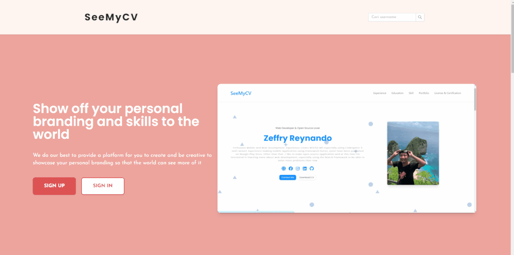
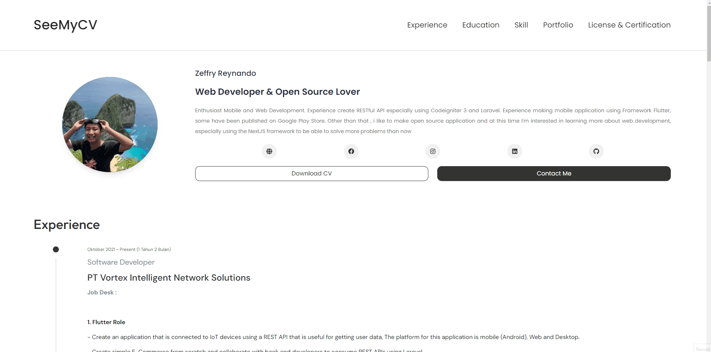

# SeeMyCV

A website that gives you a place to showcase your personal branding and expertise to the world

## Tech Stack

**Client:** React, NextJS, Ant Design, TailwindCSS

**Server:** Node, KoaJS

## Installation

1. `npm install`
2. `cp .env.example .env.development` && `cp .env.example .env.production`
3. `npm run dev`
4. Access server development at `localhost:3000`

## Features

- Landing Page
- Personal Your Website depend on Username
- Profile Section
- Experience Section
- Education Section
- Skill Section
- Portfolio Section
- Portfolio Detail Section
- License & Certificate Section

## Demo

### Landing Page

### 1. Template Default

### 2. Template Watanasa

### 3. Template Naraai

### 4. Template Hoshiru

### 5. Template Yamako

## Related

Here are some related projects

[Admin SeeMyCV](https://github.com/zgramming/admin.seemycv)
[API SeeMyCV](https://github.com/zgramming/api.seemycv)

## Feedback

If you have any feedback, please reach out to us at zeffry.reynando@gmail.com

## Authors

- [@zgramming](https://www.github.com/zgramming)
